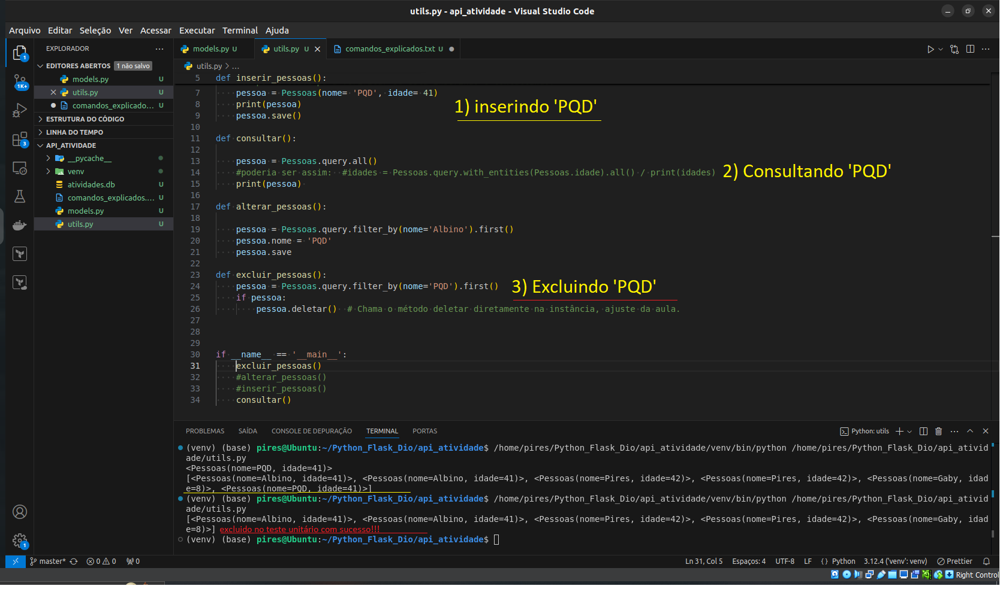

Seu README está bem organizado e informativo! Abaixo estão algumas sugestões de melhorias para tornar o conteúdo ainda mais claro e profissional:

1. **Adicionar Títulos e Subtítulos Mais Descritivos:** Use subtítulos que guiem o leitor, como "Introdução ao Projeto", "Configuração Inicial", e "Exemplos de Operações CRUD".

2. **Destaque para a Imagem de Teste Unitário**: Introduza a imagem de forma a contextualizar, por exemplo, como uma seção "Exemplo de Teste Unitário" ou "Verificação do Funcionamento do Projeto".

3. **Resumo na Introdução do Projeto SQLAlchemy**: Adicione uma breve introdução descrevendo a importância do SQLAlchemy para gerenciamento de dados.

4. **Edição de Formatação e Consistência**: Um leve ajuste nas descrições pode ajudar a manter a consistência de tom e fluidez na leitura.

Aqui está uma versão com essas melhorias integradas:

---

# 👋 Olá, eu sou Albino Pires!

🌐 **Cloud Enthusiast | AWS Cloud | Python | Linux**

🚀 Certificado em **AWS Cloud Practitioner** e estudante de **Computação em Nuvem**, com forte interesse em automação, infraestrutura como código (IaC) e DevOps. Sempre buscando aprender mais sobre tecnologias de ponta, como Python, Terraform, Kubernetes e Docker.

Atualmente, estou me preparando para a certificação **AWS Solutions Architect** e desenvolvendo projetos focados em escalabilidade e automação na **Cloud Computing**. Sou apaixonado por resolver problemas e explorar novas formas de otimizar processos.

---

## 🚀 Hard Skills

- Cloud Computing (AWS) ☁️
- Python Developer JR🐍
- Python Flask-RESTful e API REST🐍
- Infrastructure as Code (Terraform) 📜
- Kubernetes & Docker 🐳
- Git (Versionamento de Código) 🔧
- Engenharia de Prompt IA 🤖
- Monitoramento (Zabbix) 📊
- Linux e Windows 🐧🪟
- Redes 🔒

---

## 🌐 Onde me encontrar

- [](https://www.linkedin.com/in/albino-pires-b188391b3/)
- [](mailto:albinofp34@gmail.com)
- [](https://www.dio.me/users/albinofp34)

---

## 🗃️ Interação com Banco de Dados Usando SQLAlchemy

Este projeto demonstra como utilizar **SQLAlchemy** para realizar operações CRUD (Create, Read, Update, Delete) em um banco de dados SQLite. O SQLAlchemy é uma biblioteca poderosa e flexível para gerenciamento de bancos de dados em Python, permitindo a criação, consulta e manipulação de dados de maneira eficiente.

### 1. Configuração do Banco de Dados

O banco de dados é configurado com uma conexão SQLite, criando uma "engine" que serve como interface para o banco de dados:

```python
from sqlalchemy import create_engine
engine = create_engine('sqlite:///atividades.db')
```

### 2. Modelo de Dados

A classe `Pessoas` é definida como um modelo para mapear a tabela `pessoas` no banco de dados. Ela contém métodos para salvar e excluir dados.

```python
class Pessoas(Base):
    __tablename__ = 'pessoas'
    id = Column(Integer, primary_key=True)
    nome = Column(String(40), index=True)
    idade = Column(Integer)
```

### 3. Operações CRUD com SQLAlchemy

Esta seção apresenta exemplos de como realizar operações CRUD.

#### Criar (Inserir Dados)

Para inserir um novo registro, crie uma instância da classe `Pessoas` e chame o método `save`:

```python
pessoa = Pessoas(nome='Exemplo', idade=30)
pessoa.save()
```

#### Ler (Consultar Dados)

Para consultar todos os registros, use o método `query.all()`:

```python
pessoas = Pessoas.query.all()
```

#### Atualizar (Alterar Dados)

Para atualizar um registro, use `query.filter_by()` para buscar o registro, faça as modificações necessárias e salve:

```python
pessoa = Pessoas.query.filter_by(nome='Exemplo').first()
pessoa.idade = 31
pessoa.save()
```

#### Deletar (Excluir Dados)

Para excluir um registro, localize a instância e chame o método `deletar`:

```python
pessoa = Pessoas.query.filter_by(nome='Exemplo').first()
pessoa.deletar()
```

---

### 📸 Exemplo de Teste Unitário: Inclusão e Exclusão de Dados

Abaixo, uma imagem demonstrando o teste de inclusão e exclusão de dados com SQLAlchemy.



---

Este README fornece uma visão detalhada das interações com o banco de dados utilizando SQLAlchemy, abrangendo os principais comandos e estruturas para manipulação de dados no Python.