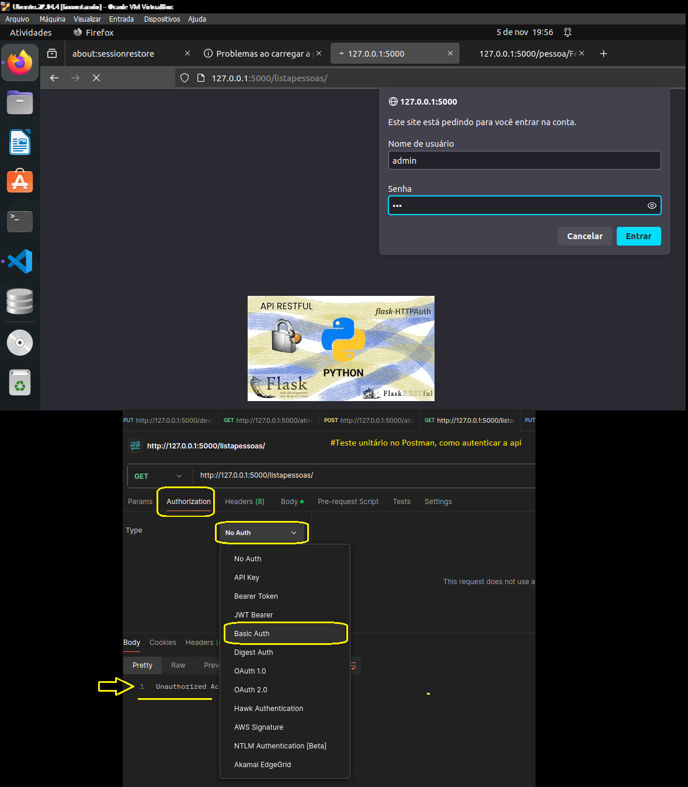

# 👋 Olá, eu sou Albino Pires!

🌐 **Cloud Enthusiast | AWS Cloud | Python | Linux | Flask**

---
# SECURITY.md

## 🛡️ Segurança e Autenticação para a API

Este documento detalha o uso de autenticação para proteger endpoints específicos da API Flask usando `flask-httpauth`. A segurança da API foi ampliada com a criação de uma tabela de usuários no banco de dados para validação direta, garantindo que apenas usuários autenticados possam acessar ou modificar dados sensíveis.

### 🚀 Instalação e Configuração do Flask-HTTPAuth

1. **Setup Utilizado**:
    - Ubuntu | VSCode | Postman | Flask-httpauth | SQLite com DB Browser

2. **Instalação do Flask-HTTPAuth**:
   - No ambiente virtual do projeto, execute:
     ```bash
     pip install Flask-HTTPAuth
     ```

### 🔒 Implementação de Autenticação com Tabela de Usuários

A autenticação foi configurada para validar o login e a senha dos usuários registrados na tabela `Usuarios` no banco de dados. Esta estrutura permite controle centralizado e seguro das credenciais.

1. **Criação da Tabela de Usuários**
   - No arquivo `models.py`, a classe `Usuarios` foi adicionada:
     ```python
     class Usuarios(Base):
         __tablename__ = 'usuarios'
         id = Column(Integer, primary_key=True)
         login = Column(String(20), unique=True)
         senha = Column(String(20))

         def save(self):
             db_session.add(self)
             db_session.commit()

         def delete(self):
             db_session.delete(self)
             db_session.commit()
     ```

2. **Inserção de Usuários no Banco de Dados**
   - No `utils.py`, foi criada uma função `insere_usuario` para adicionar novos usuários:
     ```python
     def insere_usuario(login, senha):
         usuario = Usuarios(login=login, senha=senha)
         usuario.save()
     ```
   - Esta função permite inserir usuários no banco diretamente, simplificando o processo de gerenciamento de acesso.

3. **Configuração da Verificação de Autenticação**
   - No `app.py`, a autenticação foi implementada usando `@auth.verify_password` para validar os logins a partir da tabela `Usuarios`:
     ```python
     @auth.verify_password
     def verificacao(login, senha):
         if not (login and senha):
             return False
         return Usuarios.query.filter_by(login=login, senha=senha).first()
     ```
   - Com essa verificação, apenas usuários autenticados na tabela podem acessar endpoints protegidos.

4. **Proteção de Endpoints**
   - A classe `ListarPessoas` exige autenticação. Ao testar, se um endpoint for autenticado, a sessão do navegador manterá o acesso a outros endpoints automaticamente, característica do `flask-httpauth`.
   - Exemplo de configuração:
     ```python
     class ListarPessoas(Resource):
         @auth.login_required
         def get(self):
             # código para retornar dados
     ```

5. **Exemplo de Teste da Autenticação no Navegador**:
   - O teste no navegador confirma a autenticação dos usuários registrados (veja o exemplo em `tabela_usuarios_senhas.png`).

   

### ✅ Considerações Finais e Recomendações

A implementação da autenticação com uma tabela de usuários oferece maior controle e segurança ao permitir que apenas usuários validados acessem a API. Essa abordagem é recomendada para testes de desenvolvimento e pequenas APIs. Para aplicações maiores ou em produção, autenticações mais avançadas são indicadas:

- **JWT (JSON Web Token)**: Recomendado para controle de sessão com expiração e persistência.
- **OAuth**: Ideal para integrações com contas externas de forma segura.
- **Kubernetes Secrets**: Adicionalmente, considere usar Kubernetes Secrets em ambientes Kubernetes para proteger as credenciais.

### 📈 Lições Aprendidas

Implementar a autenticação com uma tabela de usuários em Flask permite:
- Aplicar um controle de acesso flexível e centralizado.
- Aprender sobre o uso de `flask-httpauth` e bancos de dados para autenticação.
- Considerar melhorias para a segurança em ambientes maiores.

---
